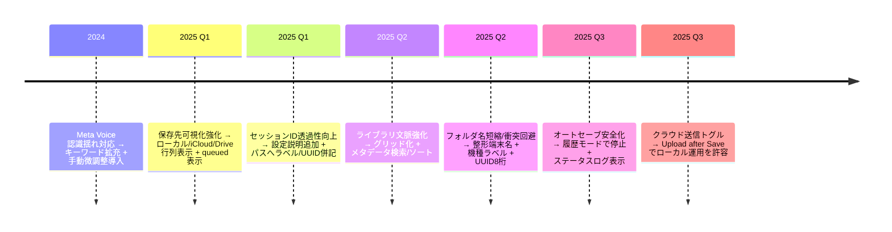

# アプリの開発履歴とユーザー指摘の対処ログ / Full Development & Feedback Ledger

本ドキュメントは、これまで寄せられたユーザビリティ向上要望やUI改善指摘を、実装の根拠・判断理由とともに時系列で残すための台帳です。既存の各メモの要約ではなく、指摘の出所・対応策・実装箇所を漏れなく辿れる形で記録し、新しい開発者が過去の経緯を理解したうえで取捨選択できることを目的としています。スクリーンショットを差し込む際は、セクション内の「挿入候補」コメントを目印にしてください。

## 参照したソースドキュメント
- ユーザビリティ改善ストーリーの基盤: `Usability & Feedback Response History`。【F:Docs/UsabilityHistory.md†L1-L34】
- UI根拠の整理と声→変更マッピング: `UI Origins & Feedback Mapping`。【F:Docs/UIOriginsAndRationale.md†L1-L39】
- 時系列ダイジェストとコード参照表: `User Feedback Responses`。【F:Docs/UserFeedbackResponses.md†L1-L25】
- Meta Voice 改善経緯と原因分析: `Meta Voice Developer Notes`。【F:Docs/MetaVoiceDeveloperNotes.md†L1-L29】
- UI設計の背景まとめ: `UI Rationale & Feedback Digest`。【F:Docs/UIRationale.md†L1-L30】

## 開発ストーリー（時系列 + 判断理由）
### 1. 保存先の見える化とクラウド挙動の明示
- **指摘の背景**: 保存後の行き先が不透明、オフライン時の挙動が不安、クラウドへ自動送信したくないケースがある。【F:Docs/UsabilityHistory.md†L5-L11】【F:Docs/UIOriginsAndRationale.md†L10-L15】
- **決定と理由**: 保存完了ポップアップにローカル/iCloud/Google Drive を色分けで並列表示し、オフライン時は queued 件数を明示。ユーザーが即時に保存先と状態を把握できる導線を最優先したため。【F:Docs/UsabilityHistory.md†L5-L11】【F:Docs/UIOriginsAndRationale.md†L10-L15】
- **実装・運用メモ**: iCloud 共有パスは「日付/端末/ファイル名」をそのまま表示し、アップロード中・失敗のみをバッジ表示して視認性を確保。【F:Docs/UsabilityHistory.md†L8-L11】
- **挿入候補**: 保存完了バナー（オンライン/オフライン比較）、iCloud/Drive ステータスチップのスクショ。

### 2. セッション識別子（人間ラベル + UUID）の透過性
- **指摘の背景**: CSVや問い合わせで識別子が読みにくい、サポート時に突合が困難。【F:Docs/UsabilityHistory.md†L13-L18】
- **決定と理由**: 設定画面に Session ID/UUID 説明セクションを追加し、保存ポップアップとクラウドパスへ人間ラベル＋UUIDを併記。画面間で一貫したメンタルモデルを提供し、検索・サポート時の混乱を抑制。【F:Docs/UIOriginsAndRationale.md†L16-L21】【F:Docs/UIRationale.md†L6-L11】
- **実装・運用メモ**: Drive 側でも Day/Session 階層にラベルを埋め込み、問い合わせ時に同じ語彙を共有できるようにした。【F:Docs/UsabilityHistory.md†L13-L18】
- **挿入候補**: 設定画面の説明セクション、保存完了バナーの「Session」行。

### 3. ライブラリ（Drive CSV一覧）の文脈強化
- **指摘の背景**: CSV 一覧がファイル名頼りで、誰の計測か判別しづらい。【F:Docs/UsabilityHistory.md†L20-L24】
- **決定と理由**: ドライバー/トラック/車両/端末/セッションラベル/UUID/日付をグリッド行で表示し、検索・並べ替え対象をメタデータに拡大。目的の記録へ直行できる情報密度を優先。【F:Docs/UIOriginsAndRationale.md†L22-L25】【F:Docs/UIRationale.md†L8-L19】
- **実装・運用メモ**: Drive CSV 一覧はメタデータ検索とソートを前提に設計。車両・端末の文脈を残すことで後追い調査が容易。【F:Docs/UsabilityHistory.md†L20-L24】
- **挿入候補**: ライブラリ画面の検索バー＋グリッド行のスクショ。

### 4. デバイスフォルダ名の短縮と衝突回避
- **指摘の背景**: 端末フォルダ名が長すぎ、空白や揺れで Finder 共有時に混乱。【F:Docs/UsabilityHistory.md†L26-L30】
- **決定と理由**: フォルダ名を「整形済み端末名（最大24文字） + 機種ラベル + UUID先頭8桁」に統一し、一意性と可読性を両立。異常入力をサニタイズすることで衝突と表示崩れを抑止。【F:Docs/UIOriginsAndRationale.md†L26-L29】【F:Docs/UIRationale.md†L8-L20】
- **挿入候補**: 日付フォルダ配下の端末フォルダ階層スクショ。

### 5. Meta Voice 音声抽出の誤認識対策
- **指摘の背景**: 長音欠落や「ゼッケン→石鹸」誤認識で項目抽出が失敗、手動修正の場が欲しい。【F:Docs/UserFeedbackResponses.md†L10-L11】【F:Docs/MetaVoiceDeveloperNotes.md†L6-L18】
- **決定と理由**: キーワードデフォルトを長音なし・誤認識語まで拡充し、旧設定と一致する場合のみ自動マイグレーション。既存ユーザー設定を壊さず改善を届ける安全策を採用。【F:Docs/UserFeedbackResponses.md†L10-L11】【F:Docs/MetaVoiceDeveloperNotes.md†L20-L23】
- **実装・運用メモ**: Meta Voice 画面に「手動で微調整」セクションを追加し、抽出直後に修正できる導線を用意。時間/周回以外は生テキストを残すリファイナで再加工による破損を防止。【F:Docs/UserFeedbackResponses.md†L10-L11】【F:Docs/MetaVoiceDeveloperNotes.md†L17-L23】
- **挿入候補**: 手動微調整カードのスクショ。

### 6. オートセーブと履歴モードの安全運用
- **指摘の背景**: 履歴閲覧中にライブ計測のオートセーブが走り上書きしないか不安、保存ログを明示してほしい。【F:Docs/UserFeedbackResponses.md†L11-L13】
- **決定と理由**: 履歴モードではオートセーブを即停止し、復元/読込/手動削除ログをUIへ流す。安全性を最優先し、過去データ閲覧時にライブ計測を汚さない方針。【F:Docs/UIOriginsAndRationale.md†L36-L39】【F:Docs/UIRationale.md†L10-L21】
- **挿入候補**: 履歴モード時のステータスログのスクショ。

### 7. 保存後クラウド送信の自己決定権
- **指摘の背景**: 「クラウドに上げたくない」「後で手動で上げたい」という運用差異への対応。【F:Docs/UserFeedbackResponses.md†L12-L25】
- **決定と理由**: 設定に「Upload after Save」トグルを設置し、ローカルのみ運用を許容。端末ニックネームをフォルダ名に埋め込み、誰のデータか判別しやすくした。【F:Docs/UserFeedbackResponses.md†L12-L25】【F:Docs/UIOriginsAndRationale.md†L10-L15】
- **挿入候補**: Profile/Export セクションとクラウド保存トグルのスクショ。

## 相反する声への対処と取捨選択の記録
- **可視性 vs. 情報量**: 保存バナーに状態を詰め込みすぎると読みづらいという声に対し、完了表示をポップアップ側に寄せ、進行中/失敗のみバッジ化して視認性を維持。【F:Docs/UsabilityHistory.md†L8-L11】
- **自動化 vs. 手動コントロール**: クラウド自動送信を望む声と、手動で確認したい声が混在したため、Upload トグルでユーザーに委ねる方針を採用。【F:Docs/UserFeedbackResponses.md†L12-L25】
- **厳密な整形 vs. データ保持**: Meta Voice で誤認識を減らすための整形と、生テキスト保持のバランスを取り、時間/周回のみ限定整形とした。【F:Docs/MetaVoiceDeveloperNotes.md†L17-L23】

## これからの拡張時に確認すべきチェックポイント
1. 新しいフィードバックが来たら「指摘背景」「決定理由」「実装メモ」「挿入候補」をこの台帳に追記し、既存の方針と矛盾しないかを確認する。
2. 旧バージョン利用者への影響（設定マイグレーション、安全策）があるかを必ず評価する。特に Meta Voice キーワードや保存先トグルは既存設定を尊重する設計が前提。【F:Docs/UserFeedbackResponses.md†L20-L25】【F:Docs/MetaVoiceDeveloperNotes.md†L20-L23】
3. 文脈を失わないメタデータ（Session ID、端末名、日付フォルダ、クラウドパス）の更新が必要かを検討し、Library 検索性への影響を明示する。【F:Docs/UsabilityHistory.md†L13-L24】
4. スクリーンショットを追加する際は、オンライン/オフライン、履歴/ライブなど状態を明記したキャプションを付ける。

## Mermaid タイムライン（主要改善の流れ）

## 追加スクショ挿入ポイント（目安）
- セクション 1: 保存完了バナーのキャプチャをここに貼付。
- セクション 3: ライブラリ検索＋グリッド行のキャプチャをここに貼付。
- セクション 5: Meta Voice 手動微調整カードのキャプチャをここに貼付。
- セクション 6: 履歴モード時のステータスログキャプチャをここに貼付。

---
本ドキュメントは「ユーザーの声 → 方針判断 → 実装箇所」を網羅的に残すことを目的としています。新しい改善を検討する際は、ここに追記して過去の経緯との整合性を確認してください。
