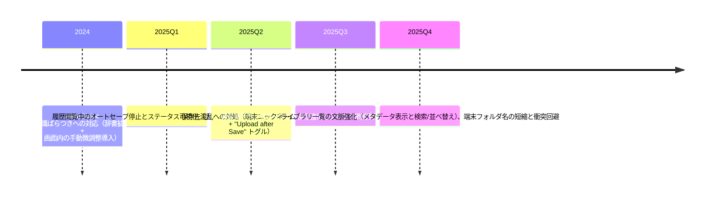

# アプリ開発履歴とユーザー指摘の総覧 / Comprehensive App Development History and User Feedback Trace

本資料は、これまでのユーザビリティ改善要望・バグ指摘と、それに対して開発がどのような取捨選択を行ってきたかを漏れなく追えるように整理したものです。次の開発者が「現在のUIが唯一の正解」と誤解しないよう、矛盾するニーズや採用・保留の判断理由を含めて記録します。

## 参照ソース / Reference Sources
- 「Usability & Feedback Response History」: 保存先可視化・識別子透過性・ライブラリ文脈強化・デバイスフォルダ名短縮などの改善ストーリーを時系列で記録。【F:Docs/UsabilityHistory.md†L1-L34】
- 「User Feedback Responses」: 音声入力補正、オートセーブ停止、クラウド保存トグルといった指摘と対応策を表形式で俯瞰。【F:Docs/UserFeedbackResponses.md†L1-L24】
- 「UI Origins & Feedback Mapping」: 上記2本を結ぶハイレベルな設計根拠。本文では詳細を再展開するが、論点の索引用として併用可。【F:Docs/UIOriginsAndRationale.md†L5-L48】

## 時系列の主要イベント / Chronology of Key Events

## テーマ別の詳細経緯 / Theme-by-Theme Trace
以下は、ユーザーからの指摘・ニーズと、それに対して実装した措置／判断を「採用した理由」「矛盾する声への折衷」「追加スクショの指示」まで含めて列挙しています。

### 1. 保存先の見える化とクラウド挙動の明示
- **指摘背景**: 保存後にファイルの所在やオフライン時の扱いが不透明で混乱。【F:Docs/UsabilityHistory.md†L5-L11】 共有への抵抗感も併せて報告あり。【F:Docs/UserFeedbackResponses.md†L10-L12】
- **採用した対応**:
  - 保存完了ポップアップにローカル/iCloud/Google Drive を色分けで並列表示し、オフライン時は queued 件数を明示することで即時の所在感を提供。【F:Docs/UsabilityHistory.md†L5-L11】
  - iCloud共有リンク配下のフォルダ階層（Day/Device/File）をそのまま表示し、ローカルとの違いを強調。【F:Docs/UsabilityHistory.md†L8-L11】
  - クラウド送信の自己決定権を確保するため、設定画面に「Upload after Save」トグルとプロフィール入力を配置し、ローカル保存のみの運用も許容。【F:Docs/UserFeedbackResponses.md†L10-L12】
- **折衷・判断メモ**: 「自動アップロードしたい派」と「ローカルのみ派」の両立を優先し、既定はクラウドONにしつつも明示的なトグルで拒否を許可。保存ポップアップ側で完了を伝える一方、バッジは進行中/失敗のみに限定し可視性と静穏性のバランスを取った。【F:Docs/UsabilityHistory.md†L8-L11】
- **スクショ挿入位置**: 本節直下に「オンライン保存完了」「オフライン queued」「Drive/iCloud ステータス切替」の3枚を貼る。ポップアップ全文が収まる画角推奨。

### 2. セッション識別子（ラベル + UUID）の透過性
- **指摘背景**: CSVや問い合わせ対応時に識別情報が分かりづらく、突合に時間が掛かる。【F:Docs/UsabilityHistory.md†L13-L18】
- **採用した対応**:
  - 設定画面に「Session ID / UUID」説明セクションを追加し、読み方・用途・クラウドへ両方を埋め込む理由を共有。【F:Docs/UsabilityHistory.md†L13-L18】
  - 保存ポップアップとDriveパスの双方にラベルとUUIDを配置し、検索やサポート時に同じ語彙で会話できるよう統一。【F:Docs/UsabilityHistory.md†L13-L18】
- **折衷・判断メモ**: UUIDのみ表示を望むセキュリティ志向の声もあったが、現場運用の迅速性を優先し人間向けラベルを併記。ログには両方残し、秘匿性が必要な場合はスクリーンショットを控える運用でカバー。
- **スクショ挿入位置**: 設定画面の Session ID セクションと、保存完了ポップアップの Session 行を並べて掲載し、画面間の一貫性を示す。

### 3. ライブラリ（Drive CSV一覧）の文脈強化
- **指摘背景**: ファイル名頼りで誰の記録か分かりにくく、検索・並べ替えの手がかりが少なかった。【F:Docs/UsabilityHistory.md†L20-L24】
- **採用した対応**:
  - グリッド形式でドライバー/トラック/車両/端末名、セッションラベルとUUID、日付フォルダを一行に集約し、メタデータを対象に検索・ソートできるよう拡張。【F:Docs/UsabilityHistory.md†L20-L24】
- **折衷・判断メモ**: 「一覧はシンプルに」という声もあったが、運用での誤ダウンロードを防ぐため情報量を優先。行間と色分けで視認性を確保する設計を採用。
- **スクショ挿入位置**: 本節下に Drive CSV 一覧画面（検索バー、並べ替えメニュー、グリッド行）の全景を1枚。必要なら行拡大の部分スクショを追加。

### 4. デバイスフォルダ名の短縮と衝突回避
- **指摘背景**: 端末フォルダ名が長すぎ・空白混入でFinder表示や共有時に混乱。【F:Docs/UsabilityHistory.md†L26-L30】
- **採用した対応**:
  - 「整形済み端末名（最大24文字） + 機種ラベル + UUID先頭8文字」でフォルダ名を統一し、サニタイズで衝突・表示バグを抑止。【F:Docs/UsabilityHistory.md†L26-L30】
- **折衷・判断メモ**: 完全に人名ベースの短縮案もあったが、重複リスクと共有時の識別性を優先し、短縮 + 一意識別子併記の方針を採用。
- **スクショ挿入位置**: 日付フォルダ配下の端末フォルダ一覧をFinder等で撮影し、短縮・整列されている様子を示す。

### 5. 音声入力 (Meta Voice) の補正フロー
- **指摘背景**: 長音欠落や誤認識（例: ゼッケン→石鹸）で項目抽出が失敗し、手動修正できる導線が欲しい。【F:Docs/UserFeedbackResponses.md†L8-L11】
- **採用した対応**:
  - 認識キーワードのデフォルトを長音なし/誤認識語まで拡充し、旧デフォルトと一致する場合のみ自動マイグレーションする安全策を導入。【F:Docs/UserFeedbackResponses.md†L8-L11】
  - Meta Voice 画面に「手動で微調整」ブロックを追加し、認識直後に修正できるワークフローを提供。【F:Docs/UserFeedbackResponses.md†L8-L11】
- **折衷・判断メモ**: 「自動整形をもっと強く」という声もあったが、既存人名の破壊を避けるため値整形は最小限に留め、利用者主導の微調整を優先。
- **スクショ挿入位置**: MetaVoiceEditorView の手動微調整セクションを強調したスクショを本節下へ。

### 6. オートセーブと履歴モードの安全運用
- **指摘背景**: 履歴閲覧中にライブ計測が上書きされる懸念、保存有無のログを即座に知りたい要望。【F:Docs/UserFeedbackResponses.md†L11-L13】
- **採用した対応**:
  - 履歴モード中はオートセーブを完全停止し、復元/読込/手動削除のログをUIへ流すことで「今何が保存されたか」を明示。【F:Docs/UserFeedbackResponses.md†L11-L13】
- **折衷・判断メモ**: 常時オートセーブを求める意見もあったが、上書き事故リスクを優先し履歴モードでは停止を選択。必要に応じて手動保存を促すUIログで補完。
- **スクショ挿入位置**: 計測画面または設定画面で、オートセーブステータスログが表示されている状態を撮影して貼付。

## 今後の更新運用 / How to Maintain This File
- 新規フィードバック対応を行う際は、本ドキュメントに「時系列イベント」と「テーマ別詳細」を追記し、元ソース（Issue/チャットログ/ユーザーヒアリング）へのリンクや引用を残す。
- 矛盾するニーズが出た場合は「折衷・判断メモ」に決定理由と将来の再検討条件を記入し、次の開発者が意図を読み違えないようにする。
- UI改修時はスクリーンショットの差し替え位置を明示し、必要であれば本ファイル内にマーメイド図を追加して時系列をアップデートする。
