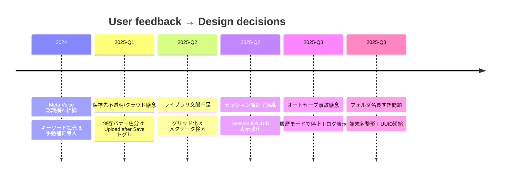

# ユーザー指摘とUI/UX変遷の全記録 / Comprehensive Chronicle of User Feedback & UI Evolution

## 目的と活用シナリオ
- 新規開発者が「今のUIが唯一の正解」だと誤解しないよう、これまでの指摘・要望・妥協点を網羅的に残す。
- 依頼者・フィールドチームからの声と、開発側で取捨選択した判断を紐づけて追えるようにし、今後の改善で過去の経緯を見失わないための参照台帳とする。
- スクリーンショットを段落内に挿入しやすい構成にしているので、適宜「ここに○○のスクショを差し込む」とメモを追記してほしい。

## 情報源（追跡用）
- 時系列ストーリー: `Docs/UsabilityHistory.md`（課題→対応の流れ）。
- 声と対策の表: `Docs/UserFeedbackResponses.md`（指摘と実装を表形式で要約）。
- UI形成の理由付け: `Docs/UIOrigins.md`, `Docs/UIOriginsAndRationale.md`, `Docs/UIRationale.md`。
- 音声入力の詳細経緯: `Docs/MetaVoiceDeveloperNotes.md`。
- 補足メモ: `Docs/CleanupNotes.md`, `Docs/GoogleDriveAccessNotes.md` など。

## 時系列の主な指摘と実装（重複しても省略せず記載）
### 2024: Meta Voice 認識揺れと手動補正の要望
- 長音が落ちる（ドライバー→ドライバ）・誤認識（ゼッケン→石鹸）が原因で抽出が失敗するとの声。
- 対応: キーワードデフォルトを長音なし／誤認識語まで拡充し、旧デフォルトと一致する場合のみ自動マイグレーション。`MetaVoiceEditorView` に「手動で微調整」ブロックを追加し、その場で修正できるようにした。
- ここに「手動で微調整」セクションのスクショを差し込む。

### 2025: 保存先の透明性とクラウド制御
- 「保存後どこへ行ったのか」「オフライン時にどうなるか」「クラウドへ上げたくないケースがある」という複数の指摘が同時期に発生。
- 対応: 保存完了ポップアップでローカル/iCloud/Google Drive を色分け表示し、オフライン時は queued 件数を明示。設定画面に Upload after Save トグルとプロフィール入力を置き、ローカルのみ保存も選べるようにした。
- ここに保存完了バナー（オンライン/オフライン）のスクショを差し込む。クラウドトグルとプロフィール入力のスクショも付与。

### 2025: ライブラリ（Drive CSV 一覧）の文脈不足
- ファイル名頼りで誰の記録か読めないとの指摘。
- 対応: ライブラリをグリッド化し、ドライバー/車両/端末名、セッションラベル+UUID、日付を一行に集約。検索・並べ替えをメタデータにも対応させた。
- ここに検索バーとグリッド行が見えるライブラリ画面のスクショを差し込む。

### 2025: セッション識別子の見え方
- CSVや問い合わせで識別子が分かりづらいとの声。
- 対応: 設定画面に Session ID / UUID 説明セクションを追加し、保存完了バナーでもラベル+UUIDを表示。クラウド側のパスにも両者を埋め込み、Day/Session 階層で検索性を確保。
- ここに設定セクションと保存バナー内「Session」行のスクショを差し込む。

### 2025: オートセーブと履歴モードの安全運用
- 履歴閲覧中にライブ計測のオートセーブが走ってデータを汚さないか不安、保存有無を知りたいとの声。
- 対応: 履歴モードではオートセーブを即停止し、復元/読込/手動削除のログを UI に流して状態を可視化。
- ここに履歴モードでステータスログが出ている画面のスクショを差し込む。

### 2025: 端末フォルダ名の長さと衝突
- Finder や共有でフォルダ名が長く紛らわしい、空白や揺れで衝突が心配との声。
- 対応: 端末名をサニタイズし24文字に整形、機種ラベルと UUID 先頭8文字を付けて短く一意なフォルダ名を生成。空白や異常入力を除去して衝突を防止。
- ここに日付フォルダ配下で端末フォルダが整形されている Finder キャプチャを差し込む。

## 対応策と判断のハイレベル整理（重複歓迎）
- **可視性を最優先**: 保存バナー・設定・ライブラリで「保存先」「同期状態」「識別子」を近い画面に並べ、バックグラウンド処理を見える化。
- **自己決定権を付与**: Upload after Save トグルやプロフィール入力でクラウド送信の有無とフォルダ命名をユーザーに委ねる。
- **文脈保持と検索性**: CSV/Drive パスに Day/Session/Device/Label/UUID を埋め込み、ライブラリ検索もメタデータを対象にする。
- **安全性のガード**: 履歴モード中のオートセーブ停止、ログ表示、Meta Voice の手動補正など「逃げ道」を必ず用意。

## 競合する要望と取捨選択のメモ
- **クラウド非依存 vs 共有性**: 共有不要の声に応え Upload after Save を切れるようにしたが、共有したい利用者向けに iCloud/Drive 行は残した。両立のため、完了バナーで送信状態のみ可視化し、完了通知はポップアップ側に寄せて視覚ノイズを削減。
- **自動化 vs 安全性**: オートセーブは便利だが履歴閲覧時は危険 → 履歴モードで完全停止し、手動保存やログ表示に寄せて事故を防止。
- **短いフォルダ名 vs 情報量**: Finder で読める長さを優先しつつ、端末名+機種+UUID8桁で一意性を確保。余分な文字はサニタイズして混乱を回避。
- **音声自動抽出 vs 現場修正**: 認識精度の改善だけでは足りないため、手動で微調整できる UI を追加し、自動化と人手補正の両立を選択。

## Mermaidで見る全体経緯（時期の重なりを可視化）

## 今後の更新ルール
- 新しい指摘が来たら本ドキュメントの「時系列」セクションに追記し、実装後も削除せず残す。矛盾する要望があれば両方書き、最終判断を別途明記する。
- スクリーンショットは該当段落直下に貼り、オンライン/オフライン、履歴モード ON/OFF など文脈が分かる状態で撮影する。
- 参考コードやドキュメントを追加した場合は、どのファイルの何行に反映したかをメモしておくと後続が辿りやすい。
- 依頼者への説明資料を作る際は、ここをベースにストーリー化し、必要に応じて `Docs/UsabilityHistory.md` や `Docs/UserFeedbackResponses.md` の該当部分を引用する。
